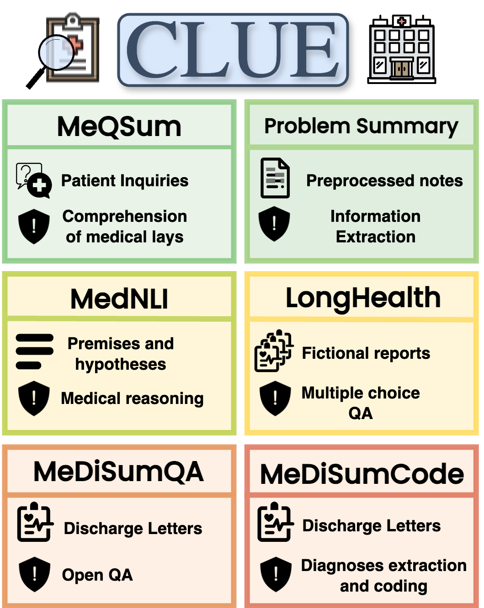

# CLUE: A Clinical Language Understanding Evaluation for LLMs

CLUE is a benchmark to evaluate the clinical language understanding of LLMS. It consists of 6 tasks, including two novel ones based on MIMIC IV notes. This repository provides the code to run the benchmark and generate the new tasks.

<p align="center">
  
</p>

## Contents
- [Motivation](#motivation)
- [Benchmark Compilation](#benchmark-compilation)
- [Run Evaluation](#run-evaluation)
- [Results](#results)
- [Acknowledgement](#acknowledgement)
- [Citation](#citation)

## Motivation

Despite the advancements promised by biomedical LLMs for patient care, a significant gap exists in their evaluation, particularly concerning their application in real-world clinical settings. Existing assessments, focused on medical knowledge through constructed questions, fall short of capturing the complexity and diversity of clinical tasks. Additionally, the rapid pace at which LLMs evolve further complicates selecting the most appropriate models for healthcare applications. In response to these challenges, CLUE aims to offer a comprehensive and standardized framework for assessing the performance of both specialized biomedical and advanced general-domain LLMs in practical healthcare tasks.

## Benchmark Compilation
We introduce two novel tasks based on MIMIC IV discharge summaries. The following section describes how to generate these tasks and collect the existing ones.

### MeDiSumQA
To run the data generation pipeline described in the paper, a few preparatory steps are necessary:

- You need access to [MIMIC-IV-Note v2.2](https://physionet.org/content/mimic-iv-note/2.2/)
- A locally running LLM. Our scripts are compatible with [Mixtral-8x7B-Instruct-v0.1](https://huggingface.co/mistralai/Mixtral-8x7B-Instruct-v0.1) hosted with the [Text Generation Inference](https://github.com/huggingface/text-generation-inference). For any other configuration, please adjust the api calls and tokenizer accordingly.
- Install our BERTScore fork to load the rescaled baseline for MIMIC: ```
pip install git+https://github.com/dadaamin/bert_score.git```

The following commands are generating the MeDiSumQA dataset:


We provide a [1-shot-example](data/MeDiSumQA/example_statements.txt) for the statement extraction prompt. To retrieve the corresponding discharge letter run:
```bash
python3 data/MeDiSumQA/get_example.py --mimic_discharge_notes <path-to-mimic-notes>
```
This should create a file data/MeDiSumQA/example_summary.txt with the discharge summary from which the statements are extracted.

To generate the question-answer pairs you can now run:


```bash
python3 data/MeDiSumQA/generate_qas.py \
    --mimic_discharge_notes <path-to-mimic-notes> \
    --max_discharge_notes 4000 \
    --example_ds data/MeDiSumQA/example_summary.txt \
    --example_ds_statements data/MeDiSumQA/example_statements.txt \
    --output_file data/MeDiSumQA/MeDiSumQA_raw_qas.json \
    --model_address <local-url-to-your-model>
```

The final step is to compute the BERTScore and ROUGE-score between the generated questions and answers and filter out the ones with the lowest similarity.

```bash
python3 data/MeDiSumQA/post_process_qas.py \
    --dataset data/MeDiSumQA/MeDiSumQA_raw_qas.json \
    --top_k_qas 500 \
    --output_path data/MeDiSumQA/MeDiSumQA.json

```

### MeDiSumCode

To generate MeDiSumCode you need access to the MIMIC IV v2.2 hosp module. Specifically the file [diagnoses_icd.csv.gz](https://physionet.org/content/mimiciv/2.2/hosp/diagnoses_icd.csv.gz).

The following script generates the dataset:

```bash
python3 data/MeDiSumCode/generate_code_dataset.py \
    --mimic_diagnoses_icd <path-to-mimic-diagnoses-icd>
    --mimic_discharge_notes <path-to-mimic-notes> \
    --output_file data/MeDiSumCode/MeDiSumCode.json \
    --max_examples 500
```


### Other Datasets

All other datasets can be downloaded with this command:

```bash

./scripts/download_datasets.sh <your-physionet-username>
```

Make sure you have access to the resources on physionet.

## Run Evaluation

To run the entire benchmark for a Hugging Face model running locally execute:

```bash
./scripts/run_benchmark.sh <model-address> <model-id>
```


## Results

### MeQSum
|                            |   ROUGE_L |   ROUGE1 |   ROUGE2 |   BERT_P |   BERT_R |   BERT_F1 |
|:---------------------------|----------:|---------:|---------:|---------:|---------:|----------:|
| llama2-7b                  |      7.16 |     8.58 |     2.89 |    27.07 |    63.55 |     37.5  |
| meditron-7b                |      6.17 |     7.47 |     2.53 |    30.67 |    61.54 |     40.53 |
| llama2-70b                 |      3.75 |     4.15 |     1.05 |    25.48 |    50.54 |     33.59 |
| meditron-70b               |      2.95 |     3.24 |     0.76 |    23.14 |    49.81 |     31.27 |
| Mistral-7B-v0.1            |      6.28 |     7.86 |     2.49 |    34.04 |    66.18 |     44.6  |
| Mistral-7B-Instruct-v0.1   |     21.85 |    25.26 |    11.17 |    61    |    72.81 |     66.15 |
| BioMistral-7B              |     24.58 |    27.38 |    12.1  |    63.6  |    71.36 |     67.05 |
| BioMistral-7B-DARE         |     26.16 |    29.69 |    13.49 |    64.29 |    74.22 |     68.68 |
| Mixtral-8x7B-v0.1          |      9.36 |    10.35 |     4.3  |    20.77 |    66.76 |     31.04 |
| Mixtral-8x7B-Instruct-v0.1 |     32.47 |    36.38 |    16.86 |    69.71 |    76.6  |     72.8  |
| zephyr-7b-beta             |     25.66 |    29.81 |    12.33 |    63.53 |    75.67 |     68.85 |

### Problem Summary

|                            |   ROUGE_L |   ROUGE1 |   ROUGE2 |   BERT_P |   BERT_R |   BERT_F1 |   UMLS_P |   UMLS_R |   UMLS_F1 |
|:---------------------------|----------:|---------:|---------:|---------:|---------:|----------:|---------:|---------:|----------:|
| llama2-7b                  |      5.97 |     7.35 |     2.11 |    53.76 |    67.06 |     59.45 |     6.86 |    22.7  |      9.06 |
| meditron-7b                |      6.49 |     7.87 |     2.59 |    54.41 |    66.6  |     59.57 |    10.23 |    27.25 |     12.52 |
| llama2-70b                 |      7.13 |     8.77 |     3.15 |    53.68 |    67.9  |     59.61 |    11.6  |    28.97 |     14.34 |
| meditron-70b               |      7.22 |     8.91 |     3.21 |    53.74 |    68.92 |     60.08 |    10.71 |    29.43 |     13.91 |
| Mistral-7B-v0.1            |      7.07 |     8.99 |     3.17 |    55.24 |    68.17 |     60.74 |    13.37 |    30.46 |     15.67 |
| Mistral-7B-Instruct-v0.1   |     14.46 |    18.6  |     6.26 |    61.17 |    71.55 |     65.79 |    16.51 |    34.93 |     20.08 |
| BioMistral-7B              |     18    |    21.85 |     8.63 |    66.4  |    67.98 |     66.96 |    23.31 |    24.03 |     20.92 |
| BioMistral-7B-DARE         |     18.81 |    22.92 |     8.93 |    66.65 |    71.9  |     68.93 |    22.75 |    30.96 |     22.65 |
| Mixtral-8x7B-v0.1          |      7.26 |     9.37 |     3.14 |    53.77 |    69.91 |     60.54 |     8.45 |    30.63 |     11.94 |
| Mixtral-8x7B-Instruct-v0.1 |     17.44 |    23.39 |     7.7  |    63.83 |    74.44 |     68.56 |    15.85 |    33.03 |     19.51 |
| zephyr-7b-beta             |     14.81 |    19.91 |     5.98 |    62.16 |    74.03 |     67.39 |    14.49 |    38.08 |     19.2  |


### MedNLI

|                            |   ACCURACY |
|:---------------------------|-----------:|
| llama2-7b                  |      29.51 |
| meditron-7b                |       2.39 |
| llama2-70b                 |      76.27 |
| meditron-70b               |      63.52 |
| Mistral-7B-v0.1            |      67.54 |
| Mistral-7B-Instruct-v0.1   |      64.79 |
| BioMistral-7B              |      62.32 |
| BioMistral-7B-DARE         |      66.76 |
| Mixtral-8x7B-v0.1          |      80.14 |
| Mixtral-8x7B-Instruct-v0.1 |      76.48 |
| zephyr-7b-beta             |      68.45 |

### LongHealth

**Task 1**:
| Mistral-7b | Mistral-7b-instruct | Zephyr-7b | Mixtral-8x7b | Mixtral-8x7b-instruct | Biomistral-7b | Biomistral-7b-DARE |
|------------|---------------------|-----------|--------------|-----------------------|---------------|--------------------|
| 15.75%     | 32.90%              | 35.4%     | 31.75%       | 74.25%                | 28.55%        | 33.55%             |


**Task 2 & 3**:
| Mistral-7b | Mistral-7b-instruct | Zephyr-7b | Mixtral-8x7b | Mixtral-8x7b-instruct | Biomistral-7b | Biomistral-7b-DARE |
|------------|---------------------|-----------|--------------|-----------------------|---------------|--------------------|
| 22.60%     | 21.43%              | 33.70%    | 31.23%       | 43.82%                | 20.72%        | 21.25%             |


### MeDiSumQA

|                            |   ROUGE_L |   ROUGE1 |   ROUGE2 |   BERT_P |   BERT_R |   BERT_F1 |   UMLS_P |   UMLS_R |   UMLS_F1 |
|:---------------------------|----------:|---------:|---------:|---------:|---------:|----------:|---------:|---------:|----------:|
| Mistral-7B-v0.1            |      7.91 |     9.56 |     3.19 |    47.39 |    61.94 |     53.59 |     6.48 |    21.9  |      9.11 |
| Mistral-7B-Instruct-v0.1   |     18.78 |    21.5  |    10.05 |    61.67 |    73.34 |     66.71 |    15.48 |    39.72 |     18.63 |
| BioMistral-7B              |     11.69 |    13.46 |     5.11 |    52.51 |    56.31 |     54.11 |    14.09 |    17.98 |     13.19 |
| BioMistral-7B-DARE         |     17.54 |    19.9  |     9.34 |    61.2  |    69.14 |     64.6  |    18.05 |    30.89 |     18.65 |
| Mixtral-8x7B-v0.1          |      8.35 |    10.21 |     3.44 |    48.66 |    64.39 |     55.3  |     5.26 |    22.63 |      8.25 |
| Mixtral-8x7B-Instruct-v0.1 |     25.54 |    29.26 |    13.89 |    66.07 |    74.18 |     69.57 |    23.07 |    36.66 |     24.47 |
| zephyr-7b-beta             |     18.2  |    21.3  |     8.91 |    60.95 |    73.24 |     66.27 |    15.2  |    41.74 |     19.06 |


### MeDiSumCode

|                            |   ICD EM P |   ICD EM R |   ICD EM F1 |   ICD AP P |   ICD AP R |   ICD AP F1 |   VALID CODES |
|:---------------------------|-----------:|-----------:|------------:|-----------:|-----------:|------------:|--------------:|
| Mistral-7B-v0.1            |       2.05 |       0.89 |        0.77 |      14.25 |       4.24 |        5.32 |         33.21 |
| Mistral-7B-Instruct-v0.1   |       0.88 |       0.57 |        0.57 |      12.32 |       2.79 |        3.78 |         37.25 |
| BioMistral-7B              |       1.59 |       0.88 |        0.65 |      10.18 |       3.77 |        4.57 |         27.88 |
| BioMistral-7B-DARE         |       1.57 |       1.65 |        1.2  |      15.06 |       6.57 |        6.66 |         56.04 |
| Mixtral-8x7B-v0.1          |       7.65 |       5.86 |        4.57 |      33.8  |      14.33 |       17.26 |         47.2  |
| Mixtral-8x7B-Instruct-v0.1 |      14.45 |       9.33 |       10.49 |      44.43 |      24.24 |       28.99 |         82.87 |
| zephyr-7b-beta             |       2.92 |       2.67 |        2.31 |      19.25 |      11.23 |       12    |         71.27 |


## Acknowledgement

This benchmark was made possible by the provision of various datasets. If you use CLUE, please cite the following works:

```bibtex
@inproceedings{romanov-shivade-2018-lessons,
    title = "Lessons from Natural Language Inference in the Clinical Domain",
    author = "Romanov, Alexey  and
      Shivade, Chaitanya",
    editor = "Riloff, Ellen  and
      Chiang, David  and
      Hockenmaier, Julia  and
      Tsujii, Jun{'}ichi",
    booktitle = "Proceedings of the 2018 Conference on Empirical Methods in Natural Language Processing",
    month = oct # "-" # nov,
    year = "2018",
    address = "Brussels, Belgium",
    publisher = "Association for Computational Linguistics",
    url = "https://aclanthology.org/D18-1187",
    doi = "10.18653/v1/D18-1187",
    pages = "1586--1596",
}
```

```bibtex
@Inproceedings{MeQSum,
author = {Asma {Ben Abacha} and Dina Demner-Fushman},
title = {On the Summarization of Consumer Health Questions},
booktitle = {Proceedings of the 57th Annual Meeting of the Association for Computational Linguistics, ACL 2019, Florence, Italy, July 28th - August 2},
year = {2019}}
```

```bibtex
@inproceedings{gao-etal-2023-overview,
    title = "Overview of the Problem List Summarization ({P}rob{S}um) 2023 Shared Task on Summarizing Patients{'} Active Diagnoses and Problems from Electronic Health Record Progress Notes",
    author = "Gao, Yanjun  and
      Dligach, Dmitriy  and
      Miller, Timothy  and
      Afshar, Majid",
    editor = "Demner-fushman, Dina  and
      Ananiadou, Sophia  and
      Cohen, Kevin",
    booktitle = "The 22nd Workshop on Biomedical Natural Language Processing and BioNLP Shared Tasks",
    month = jul,
    year = "2023",
    address = "Toronto, Canada",
    publisher = "Association for Computational Linguistics",
    url = "https://aclanthology.org/2023.bionlp-1.43",
    doi = "10.18653/v1/2023.bionlp-1.43",
    pages = "461--467",
}
```

```bibtex
@misc{adams2024longhealth,
      title={LongHealth: A Question Answering Benchmark with Long Clinical Documents}, 
      author={Lisa Adams and Felix Busch and Tianyu Han and Jean-Baptiste Excoffier and Matthieu Ortala and Alexander Löser and Hugo JWL. Aerts and Jakob Nikolas Kather and Daniel Truhn and Keno Bressem},
      year={2024},
      eprint={2401.14490},
      archivePrefix={arXiv},
      primaryClass={cs.CL}
}
```

## Citation

```bibtex
@misc{dada2024clue,
      title={CLUE: A Clinical Language Understanding Evaluation for LLMs}, 
      author={Amin Dada and Marie Bauer and Amanda Butler Contreras and Osman Alperen Koraş and Constantin Marc Seibold and Kaleb E Smith and Jens Kleesiek},
      year={2024},
      eprint={2404.04067},
      archivePrefix={arXiv},
      primaryClass={cs.CL}
}
```
